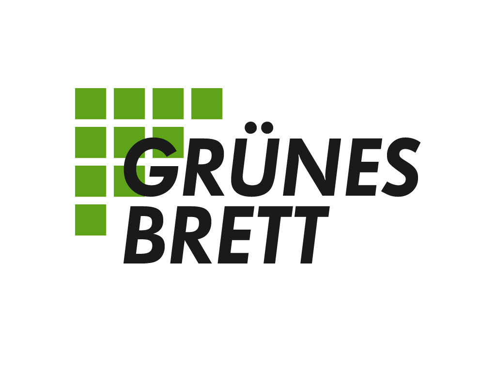

<p align="center">
  
</p>

Das Grüne Brett ist die Seite für Veranstaltungen und Aktionen zu Ökologie und Nachhaltigkeit.

In diesem Repository findest du den kompletten Code für die Webseite. Es dient außerdem als zentraler Anlaufpunkt für die [Planung der Weiterentwicklung](https://github.com/orgs/gruenes-brett/projects/1) und die [Koordination von Fehlerkorrekturen](https://github.com/gruenes-brett/webseite/issues).

## Mitmachen

Es gibt viele Möglichkeiten, am Grünen Brett mitzuwirken. Diese sind auf der Seite [Wer wir sind](https://www.gruenesbrett.net/inhalte/wer-wir-sind) zu finden. Dort sind auch unsere Kontaktdaten aufgeführt.

## Lokale Einrichtung

Zur Weiterentwicklung der Webseite müssen die folgenden beiden Software-Pakete installiert sein:

- [.NET 9 SDK](https://dotnet.microsoft.com/en-us/download/dotnet/9.0
)
- [PostgreSQL](https://www.postgresql.org/download/)

Es muss eine Datenbank erstellt werden und ggfs. der Connection-String in der `appsettings.json` hinterlegt werden.  
Anschließend kann die Webseite wie üblich für .NET-Projekte entweder aus der Entwicklungsumgebung heraus oder von der Konsole gestartet werden, z.B.:

```sh
cd src/
dotnet run
```

Die notwendigen Datenbank-Migrationen sollten automatisch beim Start angewendet werden.
